# Pulse OS v2 — "Afterglow"

**Released 21 September 2026.** Supersedes v1 (July 2026).

Pulse OS is a personal command centre: one screen that replaces the dozen apps
you open before you have finished your first coffee — weather, calendar, news,
markets, sport, music and travel.

v1 proved the idea. It put every domain behind one clean API gateway and got
them all onto a single screen that never scrolled. But it looked like what it
was: a grid of frosted cards floating on a purple haze, each view announcing
itself in centred, letter-spaced capitals. The information was there. The
product had no point of view.

**v2 is a rebuild of the entire front end around one idea: the interface should
behave like a place, and the light in that place should mean something.**

Every feature in v1 is still here, in the same place, doing the same job. What
changed is the ground it all stands on — and, in four areas, how much the
product can actually do.

---

## At a glance

| | v1 (July 2026) | v2 "Afterglow" |
|---|---|---|
| Layout | Floating glass cards on a static gradient | Sky → horizon → ground; one full-bleed surface per view |
| Background | Fixed purple haze | Living sky that follows the hour, and takes the album's colour while music plays |
| Type | One UI sans, centred tracked capitals | Newsreader + Schibsted Grotesk on a fixed eight-step scale |
| Navigation | Floating pill dock, gradient AI button | A hairline baseline across the foot of the screen, with the assistant as an ECG beat in it |
| Travel | Local-only, typed in by hand | Live flight tracking, real maps, places search, currency, destination facts |
| Assistant | Text chat, agent loop over tools | The same, plus real-time speech over a WebSocket, with barge-in |
| Immersive player | Blurred sleeve, karaoke lyrics, a starfield that ignored the music | Three switchable visuals that move to the track's real tempo |
| Launchpad | A modal app picker | A view of its own: local apps, saved sites and web search |
| Finance | Present | **Removed** |

---

## 1. A new spatial system: sky, horizon, ground

v1 composed every view the same way: a centred title, then cards. Cards inside
cards, floating on nothing, with the bottom third of the screen usually empty.

v2 gives every view the same three-part frame instead, defined once in
[`components/Stage.jsx`](frontend/src/components/Stage.jsx):

- a **sky zone** holding what the view is *about* — the day, the trip, the
  track — set large and straight on the light, with no box around it;
- a **horizon**, a single glowing line that falls at exactly the same height in
  every view, so moving between tabs does not move the ground under you;
- the **ground**: one dark surface running the full width of the window, from
  the horizon down and *under* the dock, divided into columns by space and a
  faint rule rather than chopped into floating boxes.

Only real objects still get a tile: an album sleeve, the live video, the map,
the boarding pass, an app icon. Lists sit directly on the ground.

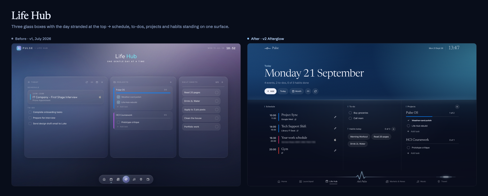

Lists are also sized to a whole number of rows
([`hooks/useWholeRows.js`](frontend/src/hooks/useWholeRows.js)), so a column
never ends on a row sliced in half by the bottom of the screen.

## 2. The light follows the hour

The background is no longer decoration. It is a sky, and it knows what time it
is: a peach dawn, a clear blue day, an ember dusk, an indigo night with stars
that fade up as the evening goes on. The colours are written as registered CSS
custom properties, so the change between phases crossfades rather than snapping
([`hooks/useSky.js`](frontend/src/hooks/useSky.js)).

While music is playing, the Music view lends the sky the album's own colours.
The screenshot below is the same app, minutes apart — the only difference is
what is on the speakers.

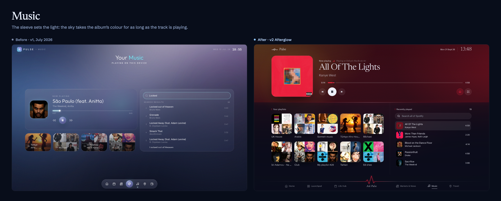

## 3. A type system, not a font choice

v1 set everything in one UI sans and reached for centred, letter-spaced capitals
whenever something needed to look important.

v2 runs two families with clear jobs — **Newsreader** for what is read at a
distance (view titles, big numbers, the assistant's name) and **Schibsted
Grotesk** for what is used up close (labels, controls, body copy), with
Vazirmatn behind both for Persian. They sit on a fixed eight-step scale
(`.t-hero` through `.t-micro`) defined once in the stylesheet. Hierarchy comes
from size *and* colour: accent-tinted eyebrows, bright titles, dim metadata.

Titles are left-aligned and share the content column with the top bar. Nothing
is set in tracked capitals.

## 4. The dock became a baseline

The floating pill dock is gone. In its place, a hairline runs the full width of
the foot of the screen with the tabs standing on it, the current tab's word
underlined. The assistant is not a button on that line — it *is* the line,
rendered as an ECG beat at the centre, with a light blip that travels the rule,
eases through the beat and continues. Line and beat are one measured SVG path,
so they can never drift out of alignment.

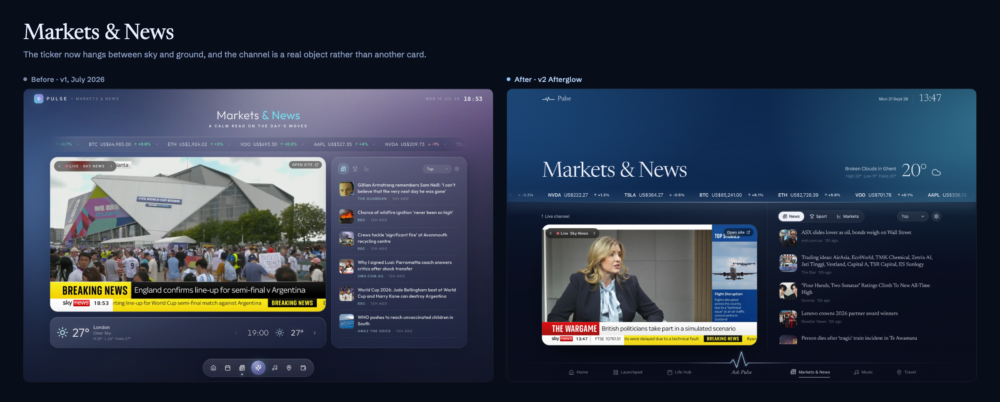

## 5. Travel is live

This is the largest functional change in the release. In v1, Travel was
deliberately offline: a countdown and some cards you filled in yourself.

In v2 it is connected. A trip now carries real flight tracking with
route, distance and time in the air; a real map of where you are going
(MapLibre over OpenFreeMap); place search; a live currency converter; local
time, weather, plug type, dialling code and emergency numbers for the
destination; and a day-by-day itinerary you can build against real places.

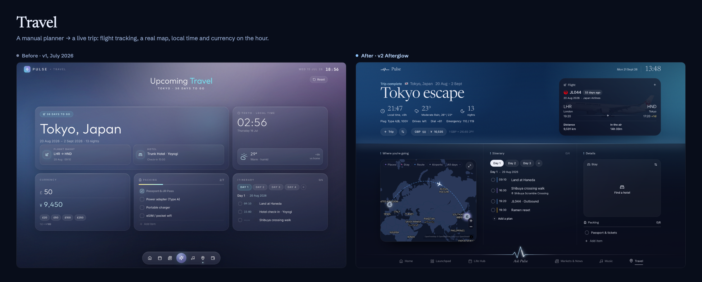

## 6. Pulse can hear you

The assistant already ran an agent loop: it was handed tool definitions
alongside the conversation, and kept executing tools and feeding results back
until it had a real answer, so it could read your live data *and* change it.

v2 keeps that and adds speech. The browser opens a WebSocket to the Express
server, which bridges it to the Gemini Live API
([`backend/src/realtime/voiceGateway.js`](backend/src/realtime/voiceGateway.js)).
Audio goes up as 16 kHz PCM from an AudioWorklet and comes back at 24 kHz;
turn-taking, voice activity detection and barge-in are handled server-side. The
voice session reuses exactly the same tool definitions as the typed assistant,
executed against live app state, so both halves of the assistant can do the same
things.

Double-tap the space bar anywhere in the app to start talking.

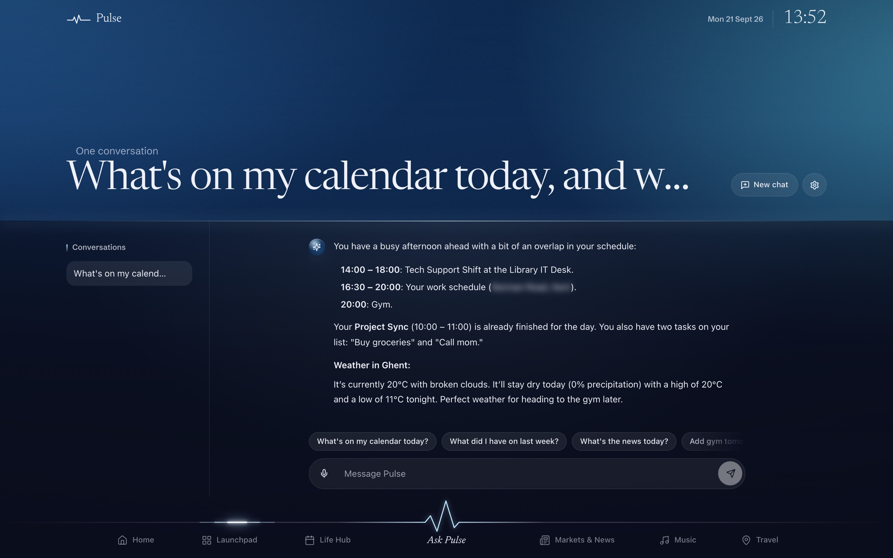

Voice is not a transcript with a microphone bolted on. It has three states and
each one looks like what it is. While you talk, a waveform tracks your voice.

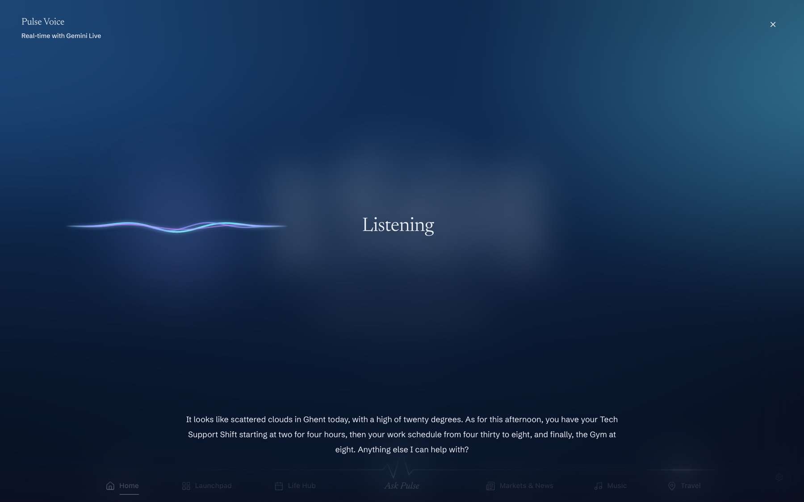

While it works, the answer stops and the task says what it is doing — a tool
call is a thing that takes time, so the interface admits it rather than
pretending the pause is thinking.

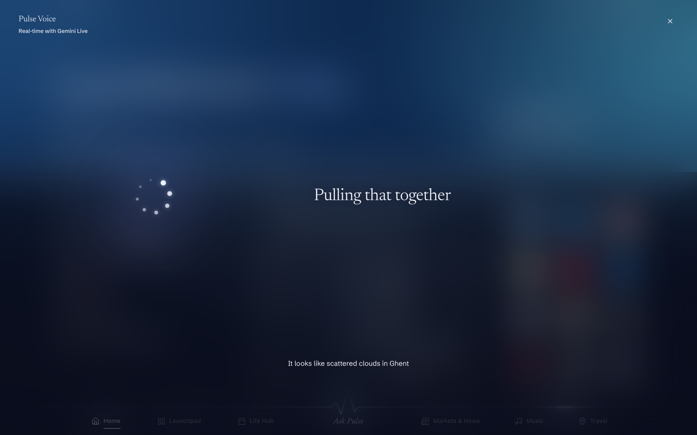

And when it answers, whatever it looked up comes up on screen beside the
spoken reply. Ask what the weather is doing and you hear the answer *and* see
the forecast it read — the same weather data the Home view is built from,
fetched by the same tool the typed assistant uses.

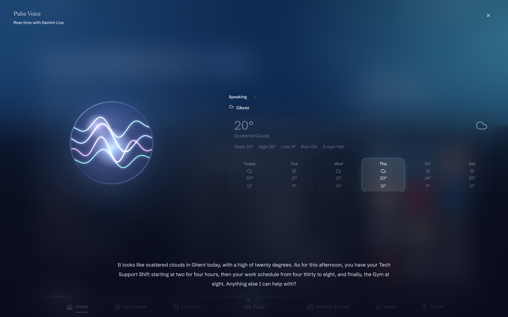

## 7. Launchpad is a place

In v1 the launchpad was a card on Home plus a modal for choosing apps. In v2 it
is a view: every application installed on the machine, with its real icon
extracted and served by the backend; saved websites alongside them; and one
search field that covers your Mac, your sites and the open web.

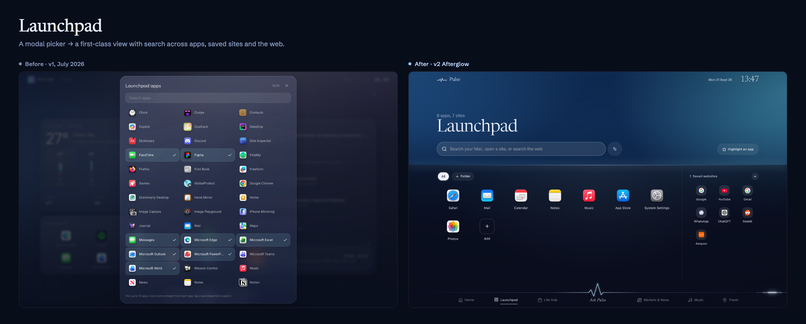

## 8. The immersive player: three rooms that move to the record

Music and the live news channel both have a full-screen mode. The music one has
been rebuilt from nothing.

Its first version did what every full-screen player does: the sleeve blown up and
blurred into wallpaper, the cover floating in a halo, karaoke lyrics glowing
beside it, a starfield drifting behind the lot that had no relationship to the
music at all. It looked like a music player because it was copying music players.

What replaces it is a visual that fills the screen and actually moves with the
track, with the record at the centre of it and the words underneath. There is no
chrome at all until you move the pointer.

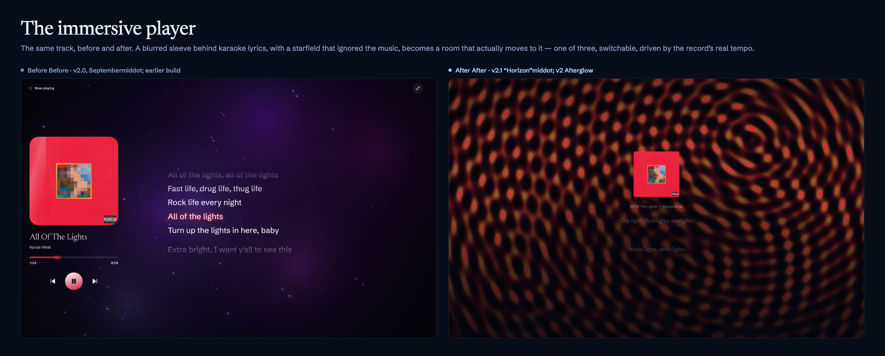

### Three of them, switchable

**Resonance** is a surface the record is vibrating — three point sources sending
rings across it, drifting on their own slow orbits, with the moiré between them
as the figure. Rings rather than straight waves, deliberately: plane waves at
fixed angles tile the screen and read as wallpaper, where circles crossing
circles never repeat.

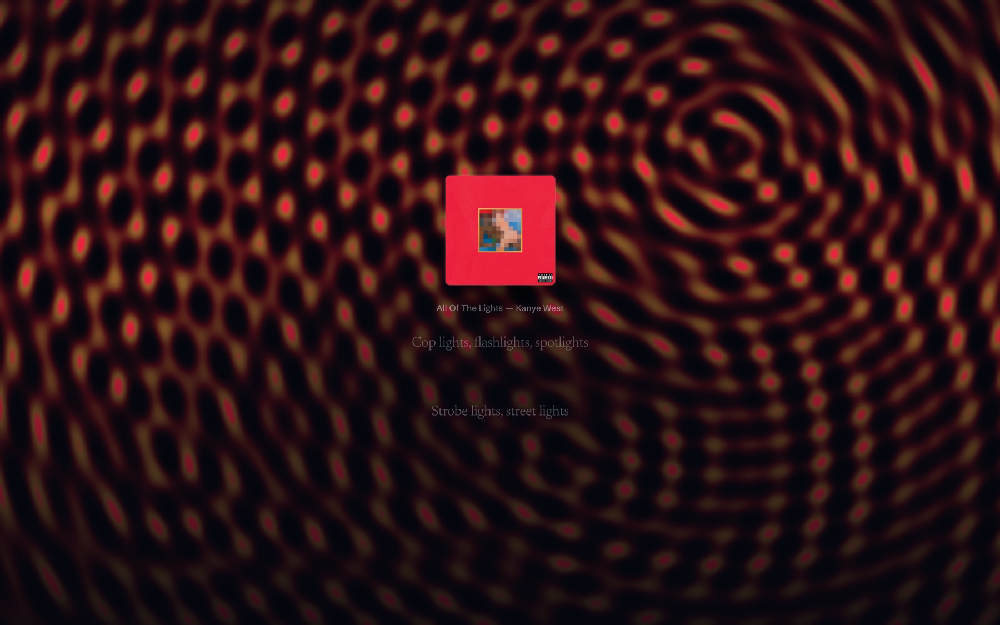

**Ink** is the album's colours released into dark water. Every sung line pushes a
plume out from behind the sleeve and the beat gives it a shove. Nothing is ever
cleared — each frame lays a nearly-transparent wash over the last, so the
diffusion *is* the fade, which is also why it costs almost nothing.

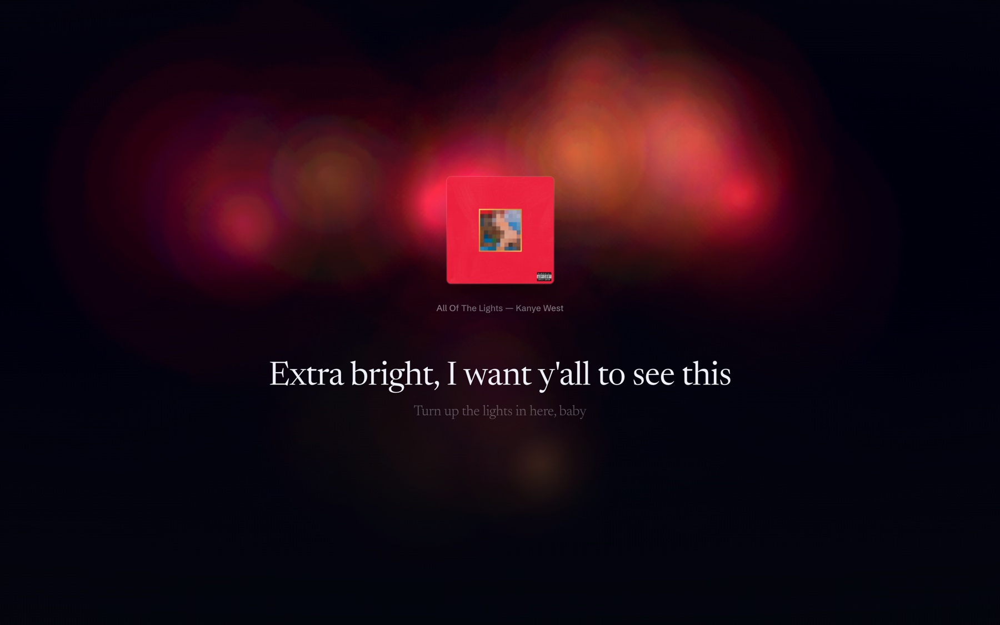

**Lattice** is a sheet of wire being pushed from behind: a field of hairlines,
flat until the music touches it, with a ring going out on every downbeat and a
stronger one on every sung line. It is the sharp one, and the one that keeps the
hairline vocabulary the rest of Pulse OS is drawn in.

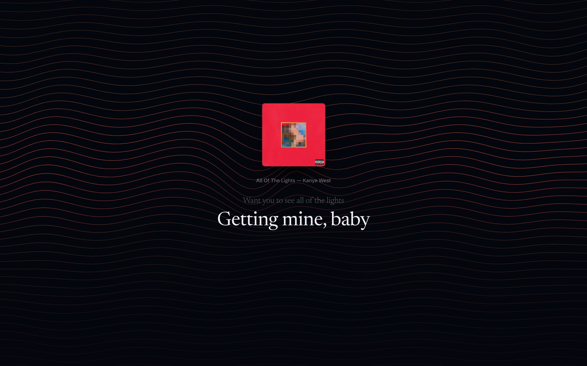

### How it knows where the beat is

This is the part that took the work. There is no audio to analyse: the record is
playing on a Spotify Connect device, so none of it reaches the page, and the Web
Playback SDK's own output is DRM-protected and cannot be routed into an
AnalyserNode. Spotify's `/audio-analysis`, which used to publish a beat timeline,
has returned 403 for apps in Development mode since November 2024.

A microphone would work, and was the obvious answer, but it is a permission
prompt, it hears the room rather than the record, and it does nothing at all on
headphones.

So the beat is reconstructed instead, from three things that are exact:

1. **the track's real tempo** — Spotify's features endpoint where it still
   answers, and ReccoBeats, which publishes the same measurements against
   Spotify track ids, where it does not;
2. **the phase of that tempo**, estimated from the synced lyric onsets. A singer
   enters on the beat far more often than not, so taking every onset modulo one
   beat and averaging them *as unit vectors* — which is what makes an average
   meaningful when the values wrap — lands close to where the beat actually sits;
3. **playback position**, reported each second and interpolated between.

The result is steadier than a microphone, needs no permission, is identical on
every play and works on headphones. What it cannot do is follow dynamics inside a
bar: it knows where the beats are, not how hard each one was hit. So the visuals
are driven by continuous oscillators running at the true tempo rather than by hard
triggers on the beat — a few tens of milliseconds of drift then reads as feel,
where a flash would read as landing in the wrong place. The accents, which do
fire discretely, come from the lyric onsets, because those are timed to the vocal
and land where you expect.

The sleeve breathes on the beat, and the sung line is set in Newsreader, which is
a variable face — so the letterforms genuinely gain and lose weight with the
music rather than merely changing opacity.

Leave the machine alone while something is playing and this takes over as the
screensaver: the controls go away, a clock appears, and the words carry on.

## 9. What we removed

**Finance is gone.** v1 shipped a Finance view — balances, net worth, a spending
trend, accounts, bills and savings goals — held entirely in local storage and
typed in by hand. It looked convincing in a screenshot and was tedious in
practice, and unlike every other domain in the app there was no honest way to
make it live without asking someone to hand their bank credentials to a personal
project. Rather than keep a view that only worked as a demo, we cut it.

Travel kept its place because it *could* be made live. It now is.

---

## Under the hood

The backend architecture from v1 is unchanged, because it held up: every request
goes `route → controller → service → provider`, so no route ever talks to a
vendor directly and any vendor can be swapped without touching anything above
it. `createApp()` builds the Express app without calling `listen()`, which keeps
it wrappable by Firebase Cloud Functions; `src/index.js` does the local listen
and, now, attaches the voice WebSocket — deliberately outside the app factory so
the Firebase path stays clean.

What grew around it:

- **New domains.** `travel` (places, flights, schedules, currency, destination
  facts), `search` (Brave, Tavily and a keyless open-web provider), `geo`, and
  `launch` for the local application launcher.
- **Cost control as a feature.** An in-memory rate limiter caps requests per
  client, with tighter limits on the AI route and on anything that changes
  state. A separate usage meter enforces hard daily and monthly request and
  token budgets per AI provider, checked *before* each call and persisted to
  disk so the counters survive a restart. The default Gemini budgets sit under
  the free tier, so the assistant cannot run up a bill.
- **Graceful degradation.** The server still boots with zero API keys.
  Unconfigured integrations return `503 NOT_CONFIGURED` rather than crashing,
  and `GET /api/status` reports exactly what is live.
- **Stale-while-erroring caching.** The TTL cache serves stale data rather than
  failing when a provider rate-limits.

### Integrations in v2

| Domain | Provider |
|---|---|
| Weather | OpenWeather |
| Stocks & crypto | Finnhub, CoinGecko |
| News | GNews + RSS, with local news resolved from your town or county |
| Live TV | HLS streams via hls.js |
| Sport | Football-Data.org (football), balldontlie (NBA, NFL), Jolpica/Ergast (F1) |
| Calendar | Google (OAuth), Apple iCloud (CalDAV), public `.ics` feeds |
| Music | Spotify Web API, Web Playback SDK and Connect; LRCLIB for lyrics |
| Travel | Google Places or OpenStreetMap, AeroDataBox, MapLibre + OpenFreeMap |
| Search | Brave, Tavily, or keyless open web |
| AI | Gemini (default), OpenAI, Anthropic Claude — swappable per request |
| Voice | Gemini Live API over WebSocket |

---

## Running it

```bash
npm install          # workspaces: frontend + backend
npm run dev          # frontend on :5173, backend on :4000
```

`backend/.env` is optional. Add keys for the integrations you want live; the
rest will report themselves as unconfigured and the app will keep working.

See [README.md](README.md) for the full layout and
[backend/README.md](backend/README.md) for endpoint details and the provider
pattern.

---

## Appendix — every view, before and after

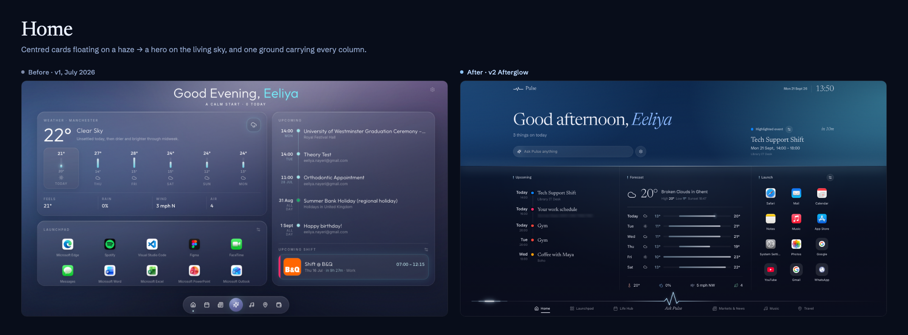

Every v2 screenshot in full is in [`docs/release/gallery/`](docs/release/gallery/).

<sub>Screenshots are of the running application against live accounts. Street
addresses and email addresses have been blurred.</sub>
