# Pulse OS — Mail

**Released 9 October 2026.** ·
**[Read the full post](https://eeliya-hub.github.io/pulseOS/announcements.html#mail)**

Gmail and Outlook now connect to Pulse OS, and the inbox joins the rest of your
day rather than sitting beside it.

Open a message and one button finds what is actually in it — the meetings, the
deadlines, the things you have been asked to do, who is involved, and whether it
needs a reply. Each one comes back as a row with the button that acts on it, so
a meeting becomes an event in your own calendar and a request becomes a task on
the project it belongs to.

The dates are the part worth knowing about. A language model asked for the
calendar date of "Thursday's design review" answers confidently and often
wrongly, so Pulse does not ask: the model only *quotes* the words the email used,
and the calendar is worked out in tested code against the day the message was
sent. The resolved date and the phrase it came from are shown side by side, so a
misreading is visible as one.

| | |
|---|---|
| **Providers** | Gmail (personal and Workspace), Outlook and Microsoft 365 |
| **Where it lives** | The Life Hub, opened from its card — not a tab of its own |
| **Scopes** | `gmail.modify` · `gmail.send` · `gmail.compose` · `Mail.ReadWrite` · `Mail.Send` |
| **Never** | Sends, deletes, archives or files anything without you. Permanent deletion is impossible — the permission is never requested. |
| **Privacy** | OAuth only, no passwords. Bodies are never written to disk and never appear in an exported backup. The assistant is given one message, one thread or one search — never a mailbox. |

Yahoo is absent because Yahoo retired its Mail API; those IMAP scopes are not
self-served. The adapter interface is shaped so a Yahoo provider is one more
file if that ever changes.

---

# Pulse OS — the launch film

**Released 7 October 2026.**

<p align="center">
  <a href="https://eeliya-hub.github.io/pulseOS/"></a>
</p>

Pulse OS has a film.

Two and a half minutes, narrated, covering every part of the app — and every
frame of it is code: Pulse's own views, rebuilt from its components and cut to
a score composed for them. With it comes a thirty-second ad, made for phones.
Both are out today.

**[Watch them on the launch page](https://eeliya-hub.github.io/pulseOS/)**, or
take the files from the **[release](https://github.com/eeliya-hub/pulseOS/releases/tag/launch-film)**.

| | | |
|---|---|---|
| **The launch film** | 2 min 29 s. 1920 × 1080, narrated, with English captions | [Watch](https://eeliya-hub.github.io/pulseOS/) · [Download, 70 MB](docs/launch/pulseos-launch-film.mp4) |
| **The ad** | 30 s. 1080 × 1920, music only | [Watch](https://eeliya-hub.github.io/pulseOS/#ad-title) · [Download, 17 MB](docs/launch/pulseos-ad.mp4) |

---

## The launch film

The film follows the tab bar from left to right. Each section opens with a
click on its tab and a title card that irises out of the click, holds, and hands
back to the app.

| | What you see |
|---|---|
| **Opening** | A single line draws itself across the dark and beats on the words: *“Every day has a pulse.”* Then nine apps scatter across the screen — *“But yours is scattered, across nine different apps”* — before all of them fall into the line. |
| **Home** | A window opens out of the line onto the day: the plans, the weather and the apps, each pulled into focus as it is named. |
| **Launchpad** | *One click away.* Every app and saved site on one shelf, with Notes opening on the word “click”. |
| **Life Hub** | *Every plan, in step.* iCal and Google Calendar connect, a to-do is ticked and a habit lit. |
| **Ask Pulse** | *Just ask.* A request typed and done — music on, and a call put in the diary. Then the microphone: voice mode listens, works and answers out loud, each plan lighting up as it is said. |
| **Markets & News** | *The world, live.* The ticker tape and the watchlist, news from your street to the other side of the world, and the fixtures for Arsenal and the Jacksonville Jaguars. |
| **Music** | *A room of its own.* Spotify connects, the playlists arrive, and the song opens into the immersive player — lit by the record’s colours, with every word in time. |
| **Travel** | *Wherever you’re headed.* The trip to Tokyo: the flight on the route map with the plane flying it, local time, the plug, the dialling code, the currency converter and the packing list. |
| **The close** | *“Remember how scattered it all felt?”* The nine apps fly back in and merge into one: *“From nine apps… to one. Everything your day needs, finally together.”* The line rises into the mark — *“Pulse OS. Your day, in a heartbeat.”* |

## The ad

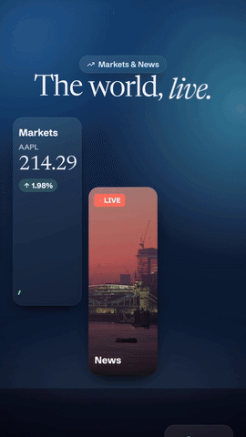

Thirty seconds, made for phones and for the sound off as much as on. There is
no narration: every part of Pulse is one clear moment, each held long enough to
read, cut to “Rising Forest” by Diego Nava.

- *Nine apps. One day.* — the notifications pile up and are pulled into the line.
- *Pulse OS.* — *Your whole day, one screen.*
- *Good morning, Eeliya.* — the weather and the day’s plans arrive.
- *Every app, one click.*
- *Every calendar, in one.* — iCal and Google Calendar pour into one month.
- *Just ask. Or just talk.* — the message turns into the voice orb.
- *The world, live.* — markets, the live news and the match.
- *Your Spotify, built in.*
- *Wherever you’re headed.* — London to Tokyo, and the stamp on arrival.
- The day passes along the line, dawn to midnight: *Your day, in a heartbeat.*

<br clear="right">

## How they were made

**Drawn, not recorded.** Both films are built in [Remotion](https://www.remotion.dev)
from Pulse’s own views, rebuilt from its components rather than recorded off a
screen — so every frame is sharp at any size, and every number on screen is the
one the story needs.

**Cut to the word.** The narration is two voices — a narrator, and Pulse
itself — generated with Google’s Gemini. Every line was read three times and the
best take chosen blind; whisper.cpp then timed every word, and the picture moves
on the words, on a ninety-beat-a-minute grid with a score composed in code. The
captions on the launch page are timed from the finished film the same way.

**Cut to the bar.** The ad has no voice at all. It runs at 124 beats a minute,
edited on the bars of its track, with forty-five sound effects set on the beats.

## Share it

- **[The launch page](https://eeliya-hub.github.io/pulseOS/)** — both films, in the browser.
- **[The release](https://github.com/eeliya-hub/pulseOS/releases/tag/launch-film)** — both films to download.
- **[The press kit](docs/launch/PRESS.md)** — ready-to-post words for LinkedIn, X, Instagram, TikTok and YouTube, the posters, the preview loops and a still from every section.

## Credits

Photographs from Wikimedia Commons, under CC BY, CC BY-SA and CC0 licences —
every author and licence is in **[docs/launch/CREDITS.md](docs/launch/CREDITS.md)**,
and needs to travel with the films wherever they are posted. The narration is
AI-generated with Google Gemini. The ad’s music is “Rising Forest” by Diego Nava
(Mixkit). Spotify, Google Calendar, Apple Calendar and the club crests are
trademarks of their owners, shown to say what Pulse connects to.

Pulse OS. Your day, in a heartbeat. *Coming soon.*

---

<sub>Earlier announcements follow, unchanged.</sub>

# Pulse OS v2 — "Afterglow"

**Released 21 September 2026.** Supersedes v1 (July 2026).

Pulse OS is a personal command centre: one screen that replaces the dozen apps
you open before you have finished your first coffee — weather, calendar, news,
markets, sport, music and travel.

v1 proved the idea. It put every domain behind one clean API gateway and got
them all onto a single screen that never scrolled. But it looked like what it
was: a grid of frosted cards floating on a purple haze, each view announcing
itself in centred, letter-spaced capitals. The information was there. The
product had no point of view.

**v2 is a rebuild of the entire front end around one idea: the interface should
behave like a place, and the light in that place should mean something.**

Every feature in v1 is still here, in the same place, doing the same job. What
changed is the ground it all stands on — and, in four areas, how much the
product can actually do.

---

## At a glance

| | v1 (July 2026) | v2 "Afterglow" |
|---|---|---|
| Layout | Floating glass cards on a static gradient | Sky → horizon → ground; one full-bleed surface per view |
| Background | Fixed purple haze | Living sky that follows the hour, and takes the album's colour while music plays |
| Type | One UI sans, centred tracked capitals | Newsreader + Schibsted Grotesk on a fixed eight-step scale |
| Navigation | Floating pill dock, gradient AI button | A hairline baseline across the foot of the screen, with the assistant as an ECG beat in it |
| Travel | Local-only, typed in by hand | Live flight tracking, real maps, places search, currency, destination facts |
| Assistant | Text chat, agent loop over tools | The same, plus real-time speech over a WebSocket, with barge-in |
| Immersive player | Blurred sleeve, floating cover, karaoke lyrics | The song drawn as a horizon, with the baseline's travelling light in the rule |
| Launchpad | A modal app picker | A view of its own: local apps, saved sites and web search |
| Finance | Present | **Removed** |

---

## 1. A new spatial system: sky, horizon, ground

v1 composed every view the same way: a centred title, then cards. Cards inside
cards, floating on nothing, with the bottom third of the screen usually empty.

v2 gives every view the same three-part frame instead, defined once in
[`components/Stage.jsx`](frontend/src/components/Stage.jsx):

- a **sky zone** holding what the view is *about* — the day, the trip, the
  track — set large and straight on the light, with no box around it;
- a **horizon**, a single glowing line that falls at exactly the same height in
  every view, so moving between tabs does not move the ground under you;
- the **ground**: one dark surface running the full width of the window, from
  the horizon down and *under* the dock, divided into columns by space and a
  faint rule rather than chopped into floating boxes.

Only real objects still get a tile: an album sleeve, the live video, the map,
the boarding pass, an app icon. Lists sit directly on the ground.

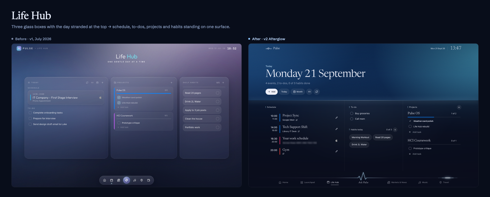

Lists are also sized to a whole number of rows
([`hooks/useWholeRows.js`](frontend/src/hooks/useWholeRows.js)), so a column
never ends on a row sliced in half by the bottom of the screen.

## 2. The light follows the hour

The background is no longer decoration. It is a sky, and it knows what time it
is: a peach dawn, a clear blue day, an ember dusk, an indigo night with stars
that fade up as the evening goes on. The colours are written as registered CSS
custom properties, so the change between phases crossfades rather than snapping
([`hooks/useSky.js`](frontend/src/hooks/useSky.js)).

While music is playing, the Music view lends the sky the album's own colours.
The screenshot below is the same app, minutes apart — the only difference is
what is on the speakers.

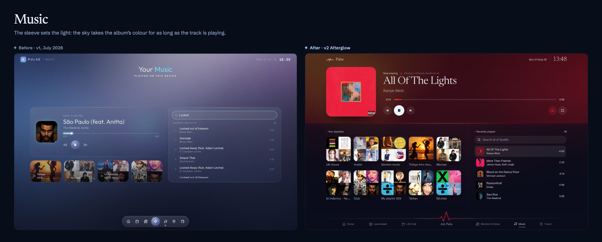

## 3. A type system, not a font choice

v1 set everything in one UI sans and reached for centred, letter-spaced capitals
whenever something needed to look important.

v2 runs two families with clear jobs — **Newsreader** for what is read at a
distance (view titles, big numbers, the assistant's name) and **Schibsted
Grotesk** for what is used up close (labels, controls, body copy), with
Vazirmatn behind both for Persian. They sit on a fixed eight-step scale
(`.t-hero` through `.t-micro`) defined once in the stylesheet. Hierarchy comes
from size *and* colour: accent-tinted eyebrows, bright titles, dim metadata.

Titles are left-aligned and share the content column with the top bar. Nothing
is set in tracked capitals.

## 4. The dock became a baseline

The floating pill dock is gone. In its place, a hairline runs the full width of
the foot of the screen with the tabs standing on it, the current tab's word
underlined. The assistant is not a button on that line — it *is* the line,
rendered as an ECG beat at the centre, with a light blip that travels the rule,
eases through the beat and continues. Line and beat are one measured SVG path,
so they can never drift out of alignment.

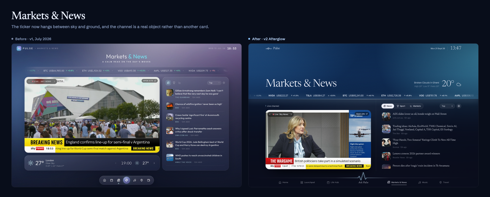

## 5. Travel is live

This is the largest functional change in the release. In v1, Travel was
deliberately offline: a countdown and some cards you filled in yourself.

In v2 it is connected. A trip now carries real flight tracking with
route, distance and time in the air; a real map of where you are going
(MapLibre over OpenFreeMap); place search; a live currency converter; local
time, weather, plug type, dialling code and emergency numbers for the
destination; and a day-by-day itinerary you can build against real places.

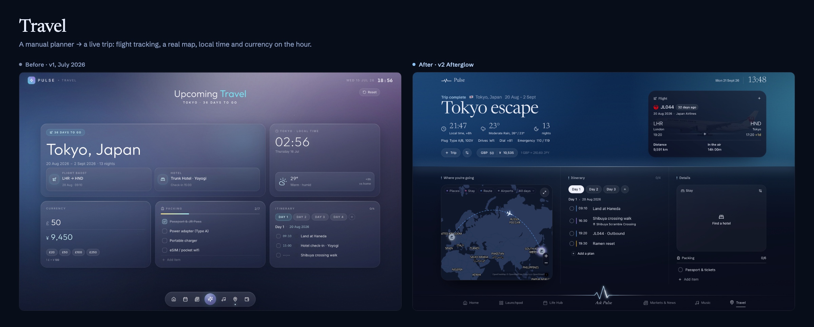

## 6. Pulse can hear you

The assistant already ran an agent loop: it was handed tool definitions
alongside the conversation, and kept executing tools and feeding results back
until it had a real answer, so it could read your live data *and* change it.

v2 keeps that and adds speech. The browser opens a WebSocket to the Express
server, which bridges it to the Gemini Live API
([`backend/src/realtime/voiceGateway.js`](backend/src/realtime/voiceGateway.js)).
Audio goes up as 16 kHz PCM from an AudioWorklet and comes back at 24 kHz;
turn-taking, voice activity detection and barge-in are handled server-side. The
voice session reuses exactly the same tool definitions as the typed assistant,
executed against live app state, so both halves of the assistant can do the same
things.

Double-tap the space bar anywhere in the app to start talking.

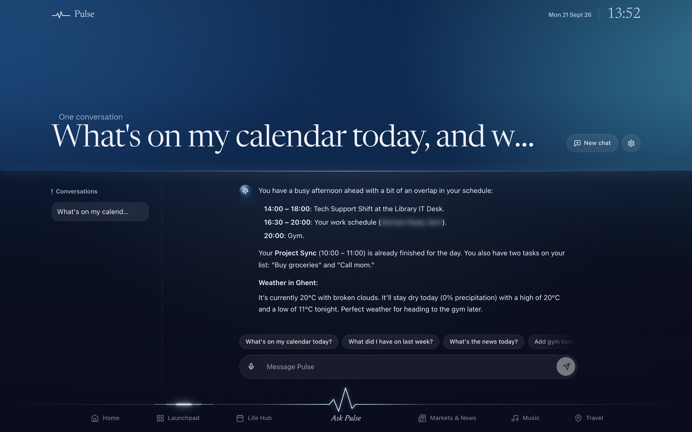

Voice is not a transcript with a microphone bolted on. It has three states and
each one looks like what it is. While you talk, a waveform tracks your voice.

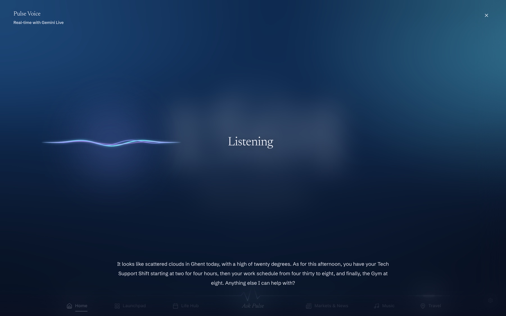

While it works, the answer stops and the task says what it is doing — a tool
call is a thing that takes time, so the interface admits it rather than
pretending the pause is thinking.

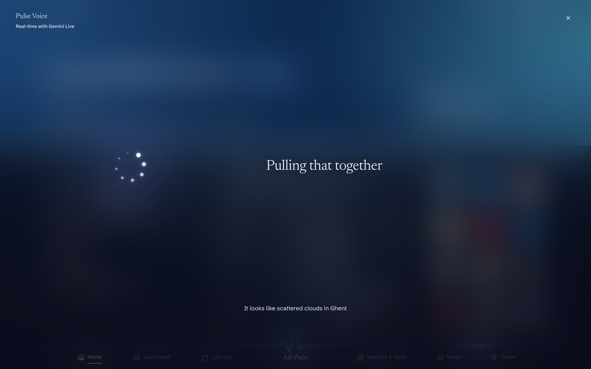

And when it answers, whatever it looked up comes up on screen beside the
spoken reply. Ask what the weather is doing and you hear the answer *and* see
the forecast it read — the same weather data the Home view is built from,
fetched by the same tool the typed assistant uses.

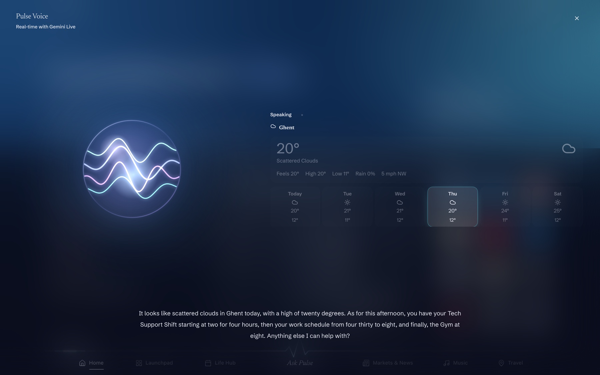

## 7. Launchpad is a place

In v1 the launchpad was a card on Home plus a modal for choosing apps. In v2 it
is a view: every application installed on the machine, with its real icon
extracted and served by the backend; saved websites alongside them; and one
search field that covers your Mac, your sites and the open web.

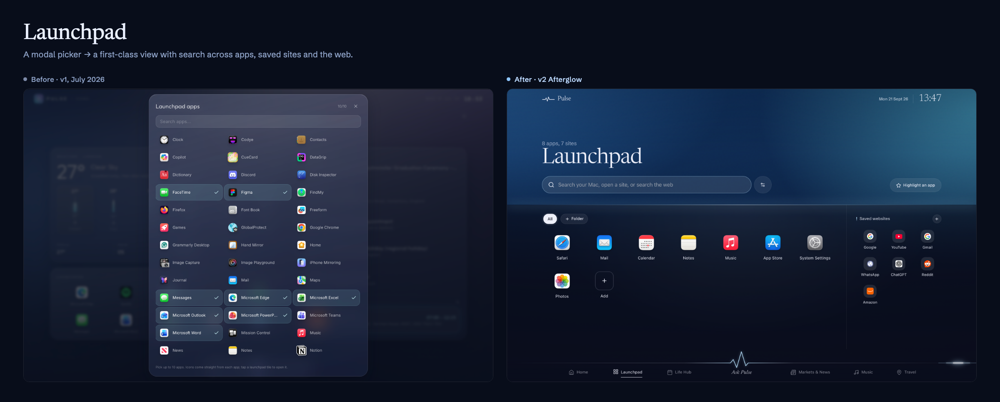

## 8. The immersive player: the song as a horizon

Music and the live news channel both have a full-screen mode. The music one has
been rebuilt.

Its first version did what every full-screen player does: the sleeve blown up
and blurred into wallpaper, the cover floating in a halo on the left, karaoke
lyrics glowing on the right. It looked like a music player because it was
copying music players.

The rebuild starts from the grammar the rest of Pulse OS is already built on. A
view is a sky, a horizon and a ground — so here, **the horizon is the track**.
The rule runs the full width of the screen and the part you have heard is lit.
Click anywhere along it to move there. Where you are shows as a light sitting in
the rule rather than a marker standing off it — the same three-part streak,
accent tails around a white core, that runs the navigation baseline at the foot
of every other view — and a second one sweeps the played stretch on a loop, its
run ending at the playhead so it never crosses music you have not reached.

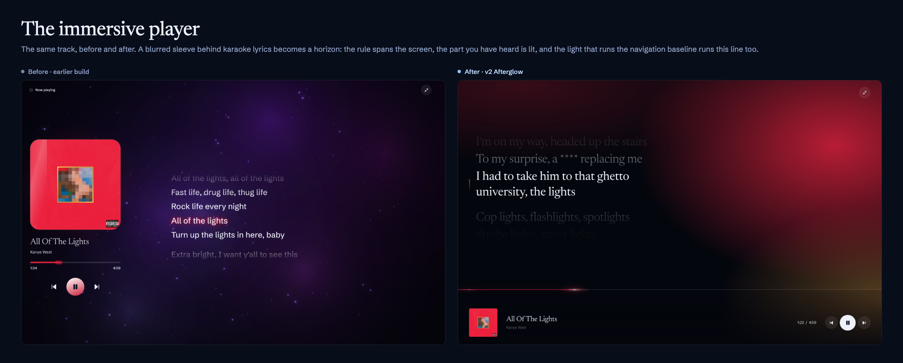

Above the line are the words, set in Newsreader because a lyric is read from
across the room — the old version set them in the interface face and the track
title in the display face, which was exactly the wrong way round. The line being
sung is simply the only bright one, marked with the same accent tick that heads
every column elsewhere in the app; there is no bloom. Below the line the record
sits on the ground as an object, square-edged and casting a shadow, and nothing
floats.

The light in the room is the sleeve's, and only the sleeve's. It does not listen
to the audio — no beat detection, nothing to tune — because this is somewhere to
leave running, not a meter to watch. The starfield and nebula the old version
drifted behind everything are gone, along with a shine that swept the cover, a
breathing halo, a parallax drift and a pulsing glow on the sung line: five
decorations that were there because they were possible.

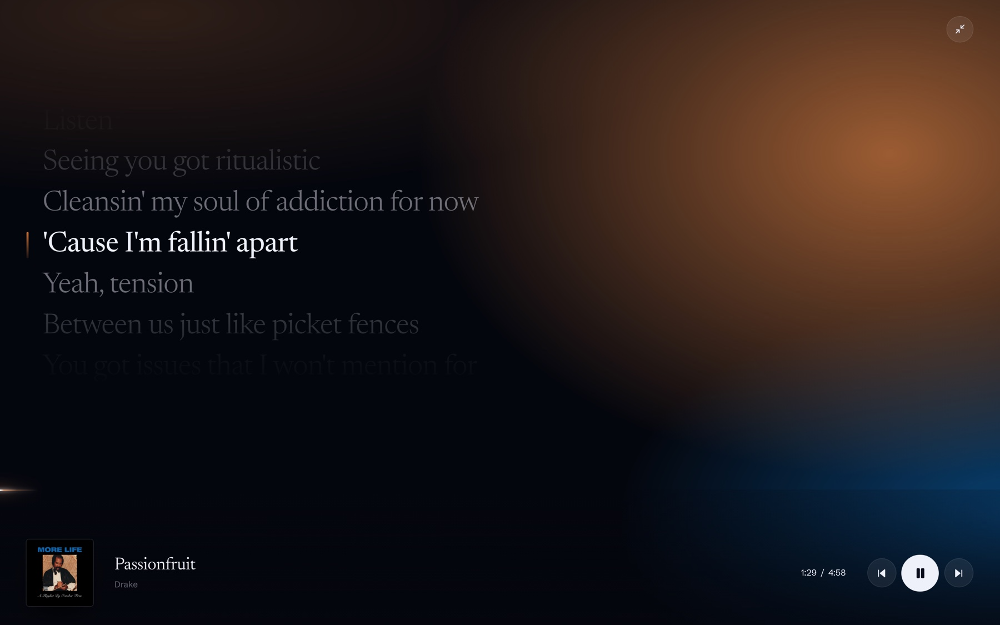

Where you are in the track is not a marker standing off the rule but a light
sitting in it — the same three-part streak, accent tails around a white core,
that runs the navigation baseline at the foot of every other view. A second one
travels the whole rule on a long loop, so the line is never quite still.

Leave the machine alone while something is playing and this takes over as the
screensaver: the transport goes away, the clock takes the ground, and the words
carry on.

## 9. What we removed

**Finance is gone.** v1 shipped a Finance view — balances, net worth, a spending
trend, accounts, bills and savings goals — held entirely in local storage and
typed in by hand. It looked convincing in a screenshot and was tedious in
practice, and unlike every other domain in the app there was no honest way to
make it live without asking someone to hand their bank credentials to a personal
project. Rather than keep a view that only worked as a demo, we cut it.

Travel kept its place because it *could* be made live. It now is.

---

## Under the hood

The backend architecture from v1 is unchanged, because it held up: every request
goes `route → controller → service → provider`, so no route ever talks to a
vendor directly and any vendor can be swapped without touching anything above
it. `createApp()` builds the Express app without calling `listen()`, which keeps
it wrappable by Firebase Cloud Functions; `src/index.js` does the local listen
and, now, attaches the voice WebSocket — deliberately outside the app factory so
the Firebase path stays clean.

What grew around it:

- **New domains.** `travel` (places, flights, schedules, currency, destination
  facts), `search` (Brave, Tavily and a keyless open-web provider), `geo`, and
  `launch` for the local application launcher.
- **Cost control as a feature.** An in-memory rate limiter caps requests per
  client, with tighter limits on the AI route and on anything that changes
  state. A separate usage meter enforces hard daily and monthly request and
  token budgets per AI provider, checked *before* each call and persisted to
  disk so the counters survive a restart. The default Gemini budgets sit under
  the free tier, so the assistant cannot run up a bill.
- **Graceful degradation.** The server still boots with zero API keys.
  Unconfigured integrations return `503 NOT_CONFIGURED` rather than crashing,
  and `GET /api/status` reports exactly what is live.
- **Stale-while-erroring caching.** The TTL cache serves stale data rather than
  failing when a provider rate-limits.

### Integrations in v2

| Domain | Provider |
|---|---|
| Weather | OpenWeather |
| Stocks & crypto | Finnhub, CoinGecko |
| News | GNews + RSS, with local news resolved from your town or county |
| Live TV | HLS streams via hls.js |
| Sport | Football-Data.org (football), balldontlie (NBA, NFL), Jolpica/Ergast (F1) |
| Calendar | Google (OAuth), Apple iCloud (CalDAV), public `.ics` feeds |
| Music | Spotify Web API, Web Playback SDK and Connect; LRCLIB for lyrics |
| Travel | Google Places or OpenStreetMap, AeroDataBox, MapLibre + OpenFreeMap |
| Search | Brave, Tavily, or keyless open web |
| AI | Gemini (default), OpenAI, Anthropic Claude — swappable per request |
| Voice | Gemini Live API over WebSocket |

---

## Running it

```bash
npm install          # workspaces: frontend + backend
npm run dev          # frontend on :5173, backend on :4000
```

`backend/.env` is optional. Add keys for the integrations you want live; the
rest will report themselves as unconfigured and the app will keep working.

See [README.md](README.md) for the full layout and
[backend/README.md](backend/README.md) for endpoint details and the provider
pattern.

---

## Appendix — every view, before and after

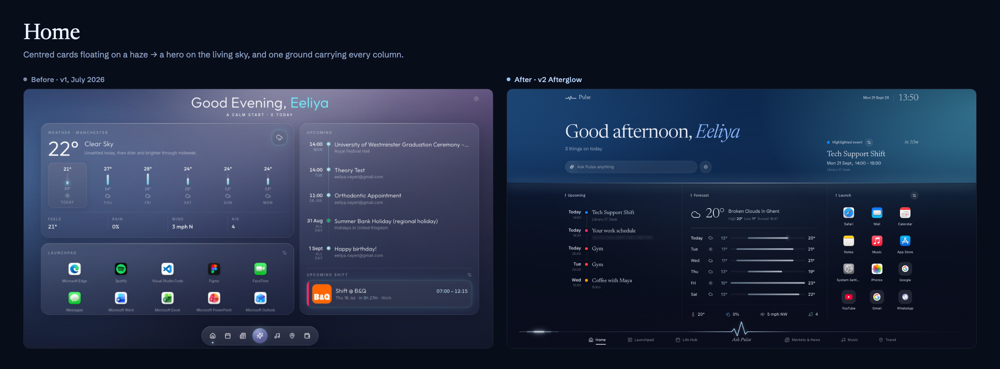

Every v2 screenshot in full is in [`docs/release/gallery/`](docs/release/gallery/).

<sub>Screenshots are of the running application against live accounts. Street
addresses and email addresses have been blurred.</sub>
