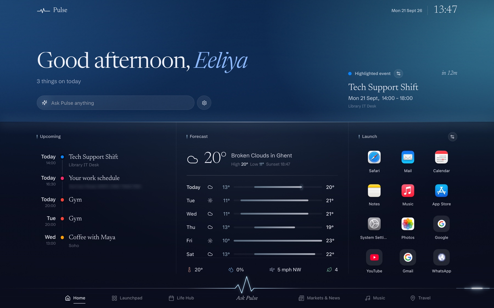

# Pulse OS

A personal command-centre dashboard — one screen that never scrolls, carrying
weather, calendar, news, markets, sport, music and travel, with an AI assistant
that can read all of it and act on it. React + Vite frontend, Express backend.

> **v2 "Afterglow" is out.** The whole frontend was rebuilt around a shared
> spatial system and a background that follows the time of day, Travel became
> live, and the assistant learned to speak. See **[ANNOUNCEMENT.md](ANNOUNCEMENT.md)**
> for the full before/after.



## Layout

```
pulseos/
├── frontend/        React + Vite dashboard
│   └── src/
│       ├── views/           Home, Launchpad, LifeHub, Markets, Music, Travel, AIAssistant
│       ├── components/      Stage (sky/horizon/ground), Sky, Dock, MusicImmersive, …
│       ├── hooks/           useSky, useWholeRows, useTravelStore, useSpotifyPlayer, …
│       └── services/api/
│           └── backendClient.js   ← the one place the frontend calls the backend
│
└── backend/         Express API gateway (clean route → controller → service → provider)
    ├── src/
    │   ├── app.js           builds the app (Firebase-ready — no listen())
    │   ├── index.js         local bootstrap; also attaches the voice WebSocket
    │   ├── config/env.js    all env access
    │   ├── routes/          weather, stocks, news, sports, ai, calendar, music,
    │   │                    travel, search, geo, launch
    │   ├── controllers/
    │   ├── services/<feature>/<vendor>.provider.js
    │   ├── realtime/        voiceGateway.js — browser WS ↔ Gemini Live
    │   ├── middleware/      cors, rate limiting, error handling
    │   └── utils/           TTL cache, token store, usage meter
    └── functions/           Firebase Functions entry
```

Every view is composed of the same three parts — a **sky zone**, a **horizon**
at a fixed height, and a full-bleed **ground** split into columns — defined once
in [`frontend/src/components/Stage.jsx`](frontend/src/components/Stage.jsx).

## Quickstart

From the repo root (npm workspaces installs both packages):

```bash
npm install
npm run dev          # frontend on :5173, backend on :4000
```

Or separately:

```bash
cd backend && cp .env.example .env && npm run dev    # :4000 — /api/status shows what's live
cd frontend && npm run dev                            # :5173
```

`.env` is optional. The server boots with zero keys; unconfigured integrations
return a clear `503 NOT_CONFIGURED` instead of crashing.

## Integrations

| Domain | Provider | Notes |
|---|---|---|
| Weather | OpenWeather | key required |
| Stocks & crypto | Finnhub, CoinGecko | Finnhub key required |
| News | GNews + RSS | key required; local news resolved by town/county |
| Live TV | HLS streams via hls.js | keyless |
| Sport | Football-Data.org, balldontlie, Jolpica/Ergast | F1 is keyless |
| Calendar | Google (read+write), Apple iCloud (CalDAV), public `.ics` | OAuth |
| Music | Spotify Web API + Web Playback SDK + Connect; LRCLIB lyrics | OAuth; lyrics keyless |
| Travel | Google Places *or* OpenStreetMap, AeroDataBox, OpenFreeMap | degrades to keyless |
| Search | Brave, Tavily, or keyless open web | optional keys |
| AI | Gemini (default), OpenAI, Claude | swappable per request |
| Voice | Gemini Live API over WebSocket | shares the typed assistant's tools |

See [backend/README.md](backend/README.md) for endpoint details, the provider
pattern, and how to add a new integration.

## Cost and safety

Every route passes through an in-memory rate limiter, with tighter caps on the
AI route and on anything that mutates state. A separate, disk-persisted usage
meter enforces hard daily and monthly request and token budgets per AI provider,
checked *before* each call — the default Gemini budgets sit under its free tier,
so the assistant cannot run up a bill. The TTL cache serves stale data rather
than failing when a provider rate-limits.

## Firebase

`src/app.js` builds the Express app without calling `listen()`, so Cloud
Functions can wrap it — see `backend/functions/index.js`. The voice WebSocket is
attached in `src/index.js` rather than the app factory, deliberately, so the
Firebase path stays clean. The OAuth `tokenStore` swaps for Firestore with no
call-site changes.

## Documentation

- [ANNOUNCEMENT.md](ANNOUNCEMENT.md) — v2 release notes, with before/after imagery
- [docs/PulseOS-Doc.html](docs/PulseOS-Doc.html) — the full project document (source for the PDF)
- [backend/README.md](backend/README.md) — API surface and provider pattern
